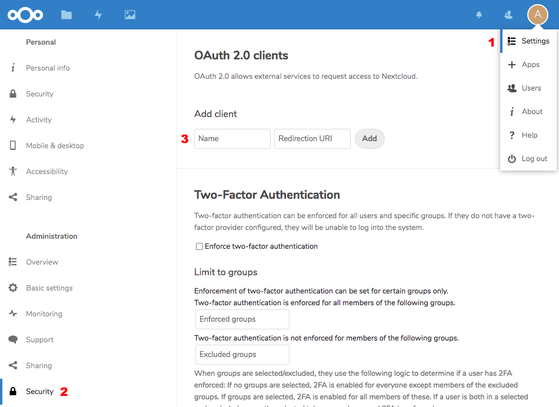

# Nextcloud OAuth2

For this backend, you need to have an OAuth2 enabled Nextcloud Instance, e.g.
on your own private server.

## Setting up Nextcloud Test Environment

To test, you only need a working Docker image of Nextcloud running on a public
URL, e.g. through [traefik](https://traefik.io/)

```docker-compose.yml
version: '2'

networks:
  traefik-web:
    external: true

services:
  app:
    image: nextcloud
    restart: always
    networks:
      - traefik-web
    labels:
      - traefik.enable=true
      - traefik.frontend.rule=Host:${NEXTCLOUD_DNS}
      - traefik.docker.network=traefik-web
    environment:
      SQLITE_DATABASE: "database.sqlite3"
      NEXTCLOUD_ADMIN_USER: admin
      NEXTCLOUD_ADMIN_PASSWORD: admin
      NEXTCLOUD_TRUSTED_DOMAINS: ${NEXTCLOUD_DNS}
```

and start it up via

```
NEXTCLOUD_DNS=goth.my.server.name docker-compose up -d
```

afterwards, you will have a running Nextcloud instance with credentials

```
admin / admin
```

Then add a new OAuth 2.0 Client by going to

```
Settings -> Security -> OAuth 2.0 client
```



and add a new client with the name `goth` and redirection uri `http://localhost:3000/auth/nextcloud/callback`. The imporant part here the
two cryptic entries `Client Identifier` and `Secret`, which needs to be
used in your application.

## Running Login Example

If you want to run the default example in `<goth>/examples`, you have to 
retrieve the keys described in the previous section and run the example
as follows:

```
NEXTCLOUD_URL=https://goth.my.server.name \
NEXTCLOUD_KEY=<your-key> \
NEXTCLOUD_SECRET=<your-secret> \
SESSION_SECRET=1 \
./examples
```

Afterwards, you should be able to log in via Nextcloud in the examples app.

## Running the Provider Test

The test has the same arguments as the login example test, but starts the test itself

```
NEXTCLOUD_URL=https://goth.my.server.name \
NEXTCLOUD_KEY=<your-key> \
NEXTCLOUD_SECRET=<your-secret> \
SESSION_SECRET=1 \
go test -v
```
